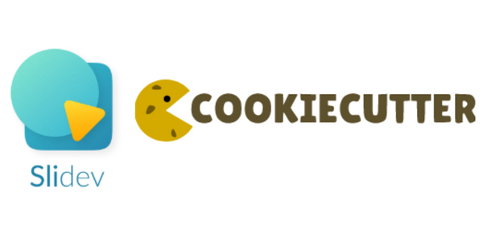

<center>



A `cookiecutter` template to generate beautiful `sli.dev` keynotes to deploy on GitHub Pages

</center>

## ⚡ Features

- CI/CD automation with GitHub Actions

> **Warning**
>
> ⚙️ Deploy to GitHub Pages
> One manual step is needed for deploying the slideshow with GitHub actions. Go to your repo's `Settings` > `Pages` > `Build and deployment` > `Source`
> and select `GitHub Actions`


## 🛠️ How to

1. Install `cookiecutter`. Using [`uv`](https://docs.astral.sh/uv/getting-started/installation/) is recommended:

```bash
uv tool install cookiecutter

2. Run the following command:

```bash
cookiecutter gh:baggiponte/cookiecutter-slidev
```

## 📝 Fields to fill in

```json
{
  "keynote_reponame": "The GitHub repository slug",
  "keynote_title": "The title of the talk/workshop/keynote",
  "keynote_host": "The conference or host",
  "author_name": "The speakers's name",
  "author_github_handle": "The speaker's GitHub handle",
  "author_job_title": "The speaker's job title",
  "requires_node": "Requires at least node 14."
}
```

## ⚠️ Warning

* The file `slides.md` sources QR code from `./public/` that point to my personal GitHub and LinkedIn profiles. This is just an example: make sure you remove them!
* The `public/qr-github.svg` is missing: you should generate a new one, e.g. using [qrcode-monkey.com](https://www.qrcode-monkey.com/) (not affiliated, just the one I use).
